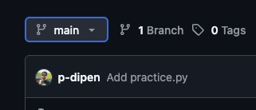

Repository = A folder where git tracks your project and it history

Clone = Make a copy of a remote repository on your computer 

Stage = Tell Git which changes you want to save next

Commit = Save a snapshot of your staged changes

Push = Send your changes to a remote repository

Your local changes (commits) to push a branch in github
branch = Work on different version or features at the same time

I want to make a new branch 
For it command it 
` git checkout -b <BranchName>`
e.g. `git checkout -b dipen-practice`

once new branch is created then 
push the branch to remote respisotry 

`git push`

if it is a new branch git will return a command to push new branch. 
`git push --set-upstream origin dipen-practice`